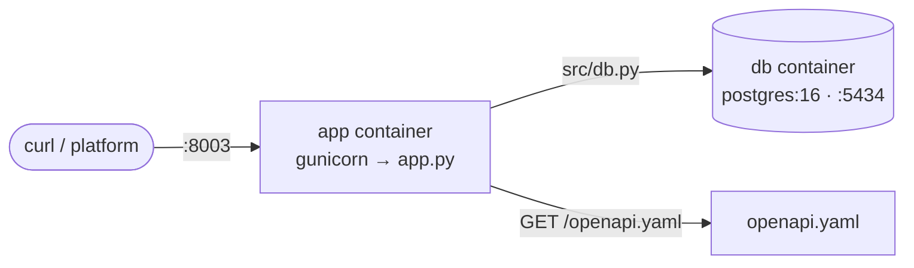

# ACC 0001: Working skeleton

Date: 2026-10-08

Status: Built on branch `feat/working-skeleton` (`81468ab`, `a32450f`) and checked locally. Not merged,
not deployed.

**Decision:** before any Access logic, `spacey-access` gets a minimal service that runs, connects to
its own Postgres, answers `GET /health` and serves its contract at `GET /openapi.yaml`, built on the
same stack and pattern as `spacey` and `spacey-payments`.

## What the skeleton is

| Part | Choice |
|---|---|
| Language, framework | Python **3.12**, **Flask 3.1** under **gunicorn**, **psycopg 3** (no ORM) |
| Dependencies | Pinned **`requirements.txt`** (pip). uv may be used locally, but the repo doesn't need it |
| Files | `app.py` (`create_app()`, routes), `src/db.py` (connection, fail fast with a clear message), `src/access.py` (empty stubs), `openapi.yaml`, `migrations/001_…sql` (not run automatically) |
| Endpoints | `GET /health`: `200 {"status":"ok","revision":…}`, or `503 {"status":"error","error":"database unreachable"}`, identical to `spacey` and Payments. `GET /openapi.yaml`: the contract |
| Config | `DATABASE_URL`, `APP_REVISION` (environment only) |
| Local run | `docker compose up`: `app` on host port **8003**, `db` (`postgres:16`) on **5434**; the app waits for the database's healthcheck |
| Tests | **pytest** against a real Postgres: health 200, health 503 with the database gone, contract served |
| CI | Every PR: tests against Postgres 16, then `docker build`. No push, no deploy |

## Why not the alternatives

| Alternative | Why not |
|---|---|
| FastAPI | A different stack from every other Spacey service; less to copy |
| uv as a requirement (as Payments does) | One more tool for everyone and for the Dockerfile and CI |
| One module (as Payments does) | Mixes HTTP with logic; separate files keep logic testable |
| No `/health` database check | The platform's health check would call a broken service healthy |
| No OpenAPI yet | Other teams need a place to read the contract from day one |

## Checked (2026-10-08, locally)

| Check | Result |
|---|---|
| `docker compose up -d --build --wait` | both containers healthy |
| `GET 127.0.0.1:8003/health` | `200 {"revision":"compose","status":"ok"}` |
| Postgres stopped, `GET /health` | `503 {"error":"database unreachable","status":"error"}` |
| `GET /openapi.yaml` | `200 application/yaml` |
| `pytest` | 4 passed |
| Without Docker (`flask --app app run --port 8003`, database in Docker) | `200` |

CI hasn't run on GitHub yet; it will on the first PR.

## Consequences

- Teammates can run, test and change the service from day one, with patterns copied from `spacey` and Payments.
- **No Access behaviour yet.** The table isn't created automatically, and there are no Access endpoints.
- `openapi.yaml` is hand-written, so it can drift from the code once endpoints arrive; contract tests come with them (ACC 0002).

## References

- [ACC 0002](0002-own-database-api-and-move-out-of-spacey.md): everything after the skeleton
- [`spacey-payments`](https://github.com/cs403bkk-2026/spacey-payments): the `create_app` and `/health` pattern copied here
