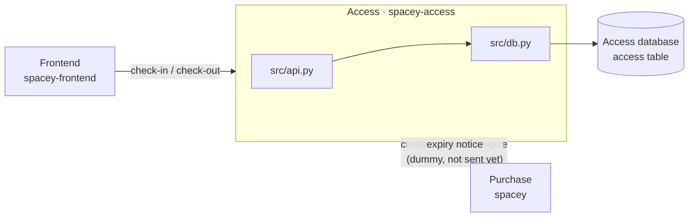

# Access service documentation

Status: **proposed** by the Access team, 2026-10-08. What exists today is only the working skeleton
(`GET /health`, `GET /openapi.yaml`). Everything else here is the plan.

| Doc | For | What's in it |
|---|---|---|
| [architecture.md](architecture.md) | everyone | Where Access sits, how the code is layered |
| [database.md](database.md) | Access team | The `access` table: full schema, states, rules |
| [api.md](api.md) | everyone | Every endpoint: who calls it, request, answers |
| [for-other-teams.md](for-other-teams.md) | **Purchase, Frontend** | How to call Access, and what not to do |
| [migrate-from-spacey.md](migrate-from-spacey.md) | Access team, Purchase | What moves out of the `spacey` monolith, and in which order |
| [production-data-migration.md](production-data-migration.md) | Access team, SRE | Copying existing access rows from `spacey` production, with the script |

Decision records live in [`ACC/`](ACC/), named `####-Title.md`:
[ACC 0001](ACC/0001-working-skeleton.md) (the working skeleton),
[ACC 0002](ACC/0002-own-database-api-and-move-out-of-spacey.md) (own database and API; moving out of `spacey`). Business meaning:
[spacey-business-rules](https://github.com/cs403bkk-2026/spacey-business-rules) (SP-T12–T21, SP-R08–R17).

## At a glance

## Open decisions (affect several docs)

| # | Decision | Where it matters |
|---|---|---|
| D1 | **Decided: `status`** — matches `migrations/001` and Payments; no rename needed | database, api, migration script |
| D2 | **Decided: shared bearer token for Purchase ↔ Access**; browser → Access authentication remains open | api, for-other-teams |
| D3 | Routing: how the browser reaches Access (a path on the same site, or its own host) | for-other-teams, migrate-from-spacey |
| D4 | What `spacey`'s `/unlock` answers while Access is down | migrate-from-spacey |
| D5 | Does check-in refuse a code at the wrong space (Q9)? | database, api |
| D6 | May a moved expiry make `expired` access `available` again (Q11)? Default: no | database, api |
| D7 | **Decided: manual `psql`** — migrations are applied by hand; no automatic startup migration in this repo | database, production-data-migration |