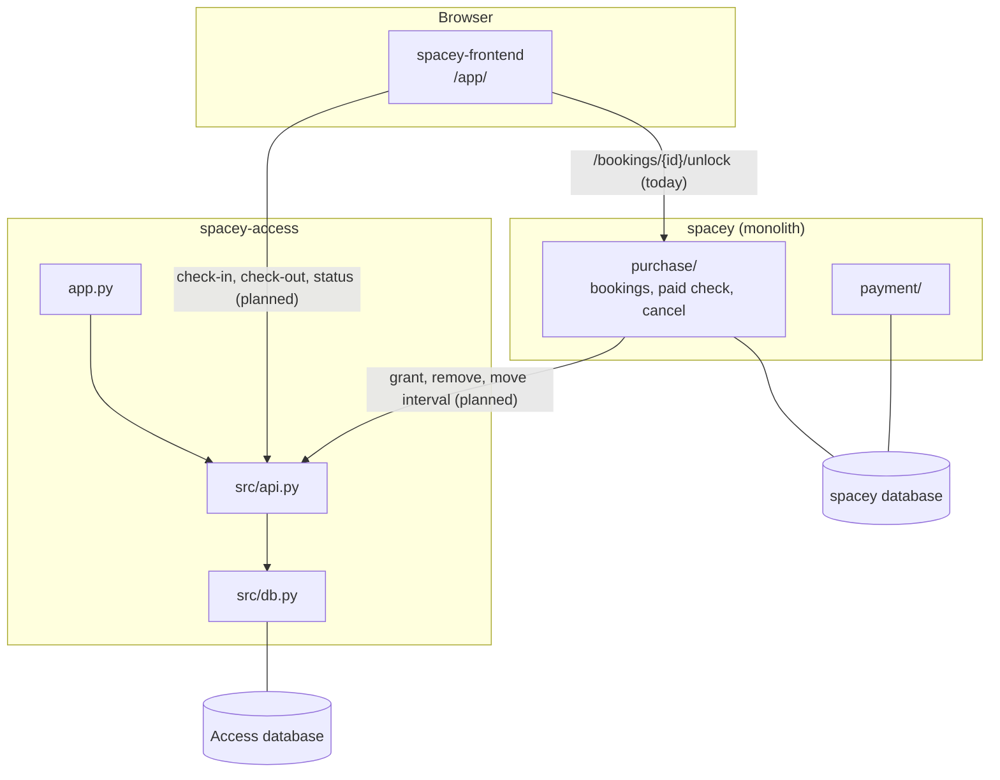
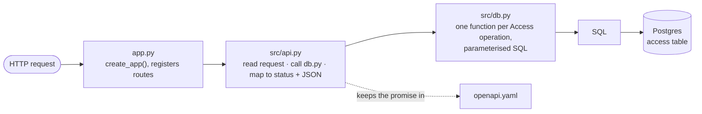

# Architecture

## Where Access sits

- **Who calls Access:** Frontend (check-in, check-out, reading the status) and Purchase (granting
  access after its paid check, removing it on cancellation, moving the interval).
- **Who Access calls:** nobody. It never reads `spacey`'s database. Anything it needs (booking id,
  interval, space) is passed in.
- **Data:** Access has **its own database**, holding only the `access` table ([database.md](database.md)).

## Code layering

| Layer | Does | Must not |
|---|---|---|
| `app.py` | Build the Flask app, connect to the database, register `src/api.py` | Hold business rules |
| `src/api.py` | HTTP only: parse, validate shape, call `db.py`, answer exactly as `openapi.yaml` says | Run SQL |
| `src/db.py` | Each operation (grant, check-in, check-out, remove, expire, read) as SQL, with the rule checks next to the SQL that enforces them. The **only** file that talks to Postgres | Know about HTTP |
| `openapi.yaml` | The contract, served at `GET /openapi.yaml` | Drift from the code (tests check it) |

**Today's skeleton** has `app.py` (with `/health` and `/openapi.yaml` routes), `src/db.py` (the
connection only) and `src/access.py` (stubs). Moving the routes into `src/api.py` and the stubs into
`src/db.py` is the first refactor.

## Run, build, deploy

| | Today | Planned |
|---|---|---|
| Local | `docker compose up`: app on `:8003`, Postgres on `:5434` | same |
| CI | tests + Docker build on every PR | + contract tests against `openapi.yaml` |
| Deploy | none | its own Nomad job (D3: routing), with `/health` as the health check |
