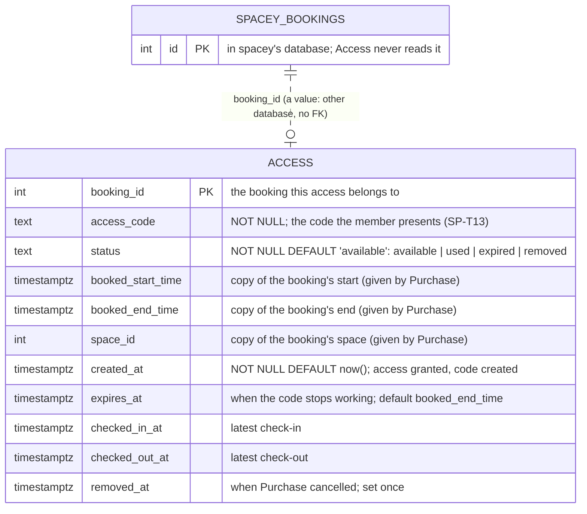
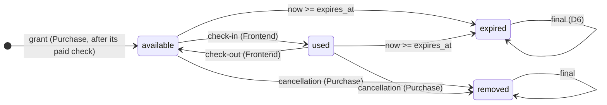

# Database

Access has **its own Postgres database** with one table, `access`. Its source of truth is
[`migrations/001_create_access_table.sql`](../migrations/001_create_access_table.sql).

## Schema



```sql
CREATE TABLE IF NOT EXISTS access (
    booking_id          INTEGER      PRIMARY KEY,
    access_code         TEXT         NOT NULL,
    status              TEXT         NOT NULL DEFAULT 'available'
                                     CHECK (status IN ('available', 'used', 'expired', 'removed')),
    booked_start_time   TIMESTAMPTZ,
    booked_end_time     TIMESTAMPTZ,
    space_id            INTEGER,
    created_at          TIMESTAMPTZ  NOT NULL DEFAULT now(),
    expires_at          TIMESTAMPTZ,
    checked_in_at       TIMESTAMPTZ,
    checked_out_at      TIMESTAMPTZ,
    removed_at          TIMESTAMPTZ
);
```

| Column | Set when | Rule |
|---|---|---|
| `booking_id` | granting access | One record per booking (SP-R10). It's a value, not a foreign key: bookings live in another database |
| `access_code` | granting access, once | Reused on every request, never regenerated (SP-R10) |
| `status` | every state change | See the states below |
| `booked_start_time`, `booked_end_time`, `space_id` | granting access; Purchase may move the interval | Copies of Purchase's facts, so Access never has to read `spacey` |
| `created_at` | granting access | — |
| `expires_at` | granting access (= `booked_end_time`); moved with the interval | SP-T15, SP-R17 |
| `checked_in_at`, `checked_out_at` | check-in, check-out | The **latest** of each (SP-R16) |
| `removed_at` | cancellation, **first time only** | SP-R12 |

**Naming:** `_time` for the copied interval, `_at` for events and the deadline. **D1:** the column is
`status`, as in the migration and Payments' table. `spacey`'s older `docs/access-table.md` says
`access_status`, so align that doc.

## States



## Rules the database work must keep

- **Never delete a row.** Cancellation and expiry are states (SP-R12).
- **Refusals change nothing:** a refused check-in leaves the row exactly as it was.
- **Set-once times stay set:** a repeated removal keeps the first `removed_at`.
- **One record per booking, even under concurrent calls:** use `INSERT … ON CONFLICT (booking_id)`, or row locks for state changes.
- **Expiry is lazy:** checked when a row is touched (and optionally by a sweep). There's no scheduler (SP-R17).
- **Every migration is safe to run twice** (`IF NOT EXISTS`), and only ever adds.

## Not decided

- D5: whether `space_id` is used to refuse a code at the wrong space
- D6: whether a later expiry may un-expire a row
- D7: how migrations run (by hand with `psql` today)
- whether `access_code` should be `UNIQUE`: not needed while every lookup also has the `booking_id`
