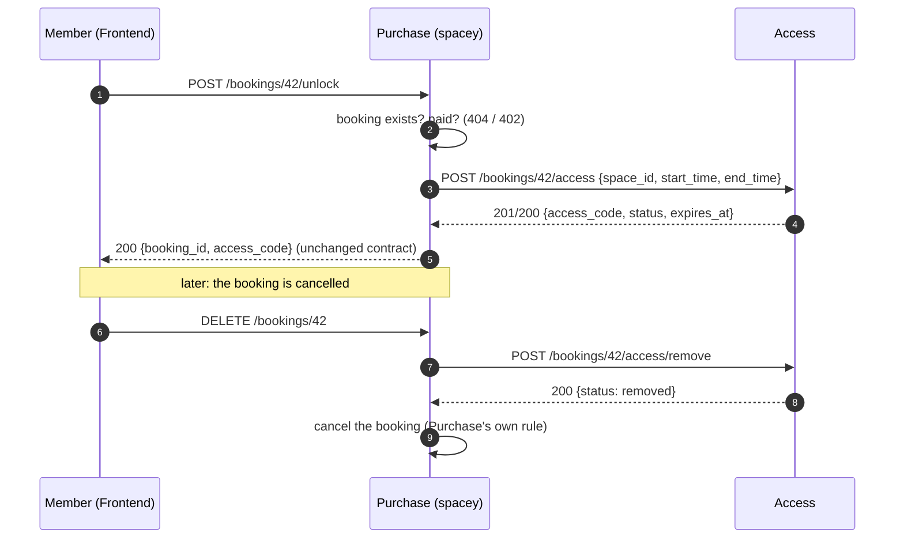

# For other teams: how to use Access

Short version: **call our HTTP API, never our database.** The contract is
[`openapi.yaml`](../openapi.yaml) (live at `GET /openapi.yaml`); [api.md](api.md) is the readable
table. Everything below the "today" line is **proposed**: tell us what to change.

## Purchase (`spacey`)

| You do | Call | Notes |
|---|---|---|
| Unlock for a **paid** booking | `POST /bookings/{id}/access` with space and interval | **You** check that the booking is paid; we don't. Safe to retry: the same code comes back |
| Cancel a booking | `POST /bookings/{id}/access/remove` **before** your own cancel | Safe to retry. We keep the record |
| Change a booking's time | `PATCH /bookings/{id}/access` | Moves our copy of the interval and the expiry |

**What we need you to agree:** these three calls; the unlock forwarding (Frontend keeps calling your
`/unlock`); what `/unlock` answers if Access is down (D4); and authentication (D2).

## Frontend (`spacey-frontend`)

| You want | Call | Notes |
|---|---|---|
| Check in with a code | `POST /bookings/{id}/check-in` `{access_code}` | `200` on success; `403`/`409` carry the reason |
| Check out | `POST /bookings/{id}/check-out` | — |
| Know which section to show | `GET /bookings/{id}/access` | Never returns the code |
| Get the code (as today) | **unchanged:** `POST /bookings/{id}/unlock` on `spacey` | Purchase forwards it to us |

**Your call:** the API shape for check-in and check-out. We follow the spec you agree. Please also tell
us how the browser should reach us (D3: a path on the same site, or our own host).

## Rules for everyone

- **Don't read or write the Access database.** Ask for an endpoint instead.
- **Treat `access_code` as a secret:** don't log it or put it in URLs.
- **Errors** are `{"error": "..."}`; times are ISO 8601 with an offset.
- **Changing the API** starts with a PR to `openapi.yaml` that the caller reviews. Code follows.
- **Check that we're up** with `GET /health` (200 ok, or 503 if our database is down).
