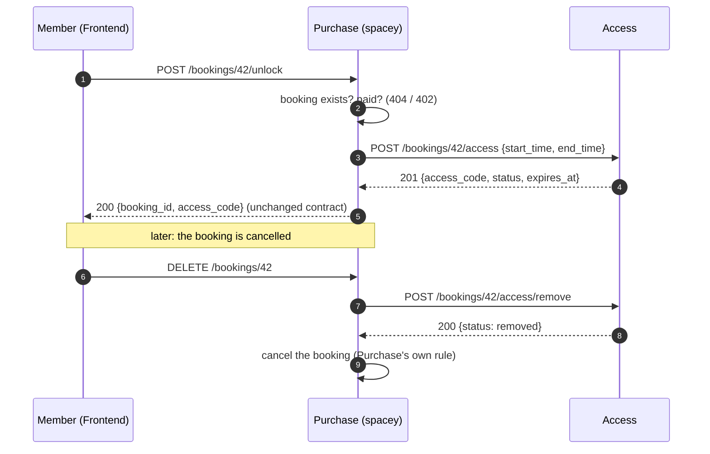

# For other teams: how to use Access

Short version: **call our HTTP API, never our database.** The contract is
[`openapi.yaml`](../openapi.yaml) (live at `GET /openapi.yaml`); [api.md](api.md) is the readable
table. Every endpoint exists, answering with **dummy** values until the real logic lands.

## Purchase (`spacey`)

| You do | Call | Notes |
|---|---|---|
| Unlock for a **paid** booking | `POST /bookings/{id}/access` with the booking's start and end | **You** check that the booking is paid; we don't. Safe to retry: the same code comes back |
| Cancel a booking | `POST /bookings/{id}/access/remove` **before** your own cancel | Safe to retry. We keep the record |
| The booking ended (your clock) | `POST /bookings/{id}/access/expire` | Safe to retry |
| *(we call you)* access ended (our clock) | `POST {PURCHASE_URL}/bookings/{id}/access-expired` | **You add this endpoint.** Not sent until it exists |

All three Purchase-to-Access calls require `Authorization: Bearer <shared secret>`.
Access reads the shared value from the platform-provided `SERVICE_TOKEN`;
requests without a matching token receive `401` before request validation or
database work. Provision the same value to Purchase through the platform and
Purchase's CI secret store. Never put the secret in source control.

Access's future expiry notice to Purchase will use that same token in the
`Authorization: Bearer` header.

**What we need you to agree:** the shared secret provisioning with Purchase and
SRE; the unlock forwarding (Frontend keeps calling your `/unlock`); and what
`/unlock` answers if Access is down (D4). The agreed D2 contract is the
`Authorization: Bearer` header.

## Frontend (`spacey-frontend`)

| You want | Call | Notes |
|---|---|---|
| Check in with a code | `POST /bookings/{id}/check-in` `{access_code}` | `200` on success; `403`/`409` carry the reason |
| Check out | `POST /bookings/{id}/check-out` | — |
| Get the code (as today) | **unchanged:** `POST /bookings/{id}/unlock` on `spacey` | Purchase forwards it to us |

**Your call:** the API shape for check-in and check-out. We follow the spec you agree. Please also tell
us how the browser should reach us (D3: a path on the same site, or our own host).

## Rules for everyone

- **Don't read or write the Access database.** Ask for an endpoint instead.
- **Treat `access_code` as a secret:** don't log it or put it in URLs.
- **Errors** are `{"error": "..."}`; times are ISO 8601 with an offset.
- **Changing the API** starts with a PR to `openapi.yaml` that the caller reviews. Code follows.
- **Check that we're up** with `GET /health` (200 ok, or 503 if our database is down).
