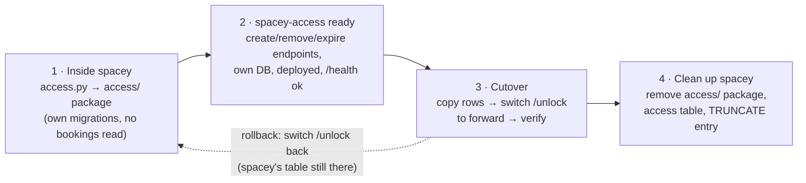

# Migrating Access out of `spacey`

Inventory checked on `spacey` `main` at `17c7d2d` (2026-10-08). The decision is ADR 0004 in
`spacey` (draft).

## What exists in `spacey` today, and where it goes

| In `spacey` | What it is | Goes to | Notes |
|---|---|---|---|
| `access.py` → `issue_access_code()` | Paid check + insert or return the code | `spacey-access` `src/db.py` (`create_access`) | The **paid check stays in Purchase**: Access doesn't read `bookings` |
| `purchase/schema.py`: `CREATE TABLE access (…)` | The table, 3 columns, `ON DELETE CASCADE` to `bookings` | `spacey-access` `migrations/001_…sql` (11 columns, no FK) | Removed from `spacey` only after cutover |
| `app.py`: `POST /bookings/<id>/unlock` | The only route using Access | **stays in `spacey`** (Purchase): checks paid, then forwards to `POST /bookings/{id}/access` | Frontend keeps calling it unchanged (proposed) |
| `app.py`: `reset_tables()` `TRUNCATE access, …` | Test reset | drop `access` from it in cleanup | — |
| `openapi.yaml`: `/bookings/{bookingId}/unlock` | The contract Frontend uses | **stays in `spacey`**, unchanged | Access's own endpoints live in our `openapi.yaml` |
| `tests/test_app.py`: `test_unlock_before_paying_is_rejected`, `test_unlock_a_paid_booking_returns_an_access_code`, `test_unlocking_twice_returns_the_same_stored_code`, `test_the_access_code_survives_a_restart`, `test_cancelling_a_booking_removes_its_access_code`, `test_unlock_unknown_booking_returns_404` | Unlock behaviour | **stay in `spacey`** as the proof `/unlock` still works after forwarding. The code-reuse behaviour also gets tests here | They must stay green through every step |
| `payment/tests/test_payment.py::test_failed_payment_leaves_the_booking_unpaid_and_unlock_returns_402` | Payments' check of unlock | stays | Must stay green |
| Production rows in `access` | Existing codes | Access's database, copied once | [production-data-migration.md](production-data-migration.md) |
| Branch `access-new-table` (`docs/access-table.md`, new columns in `spacey`) | Earlier design | its content is now [database.md](database.md) | Not merged into `spacey`; close it once this is agreed |

**Nothing else in `spacey` touches Access.**

## Order

| Step | Done when |
|---|---|
| 1 | All unlock tests green; `access` DDL out of `purchase/schema.py`; Access code doesn't read `bookings` |
| 2 | `spacey-access` deployed; `/health` 200; create, remove and expire endpoints tested against our `openapi.yaml` |
| 3 | Row count copied = row count in `spacey`; `/unlock` answers the same code as before for an existing booking; a new booking gets a code from Access |
| 4 | `spacey` has no Access code or table left; its suite is green |

**Rollback until step 4:** switch `/unlock` back to the local code. `spacey`'s `access` table still
exists, but codes granted in Access after the cutover would be missing there. Keep the cutover window
short, or copy them back (to decide, D4).

## Needs agreement first

- **Purchase:** the forwarding in `/unlock`, calling `access/remove` on cancel, and owning the paid check
- **Frontend:** nothing for unlock (unchanged); the check-in/check-out request is separate
- **SRE / platform:** Access's database, Nomad job and routing (D3)
