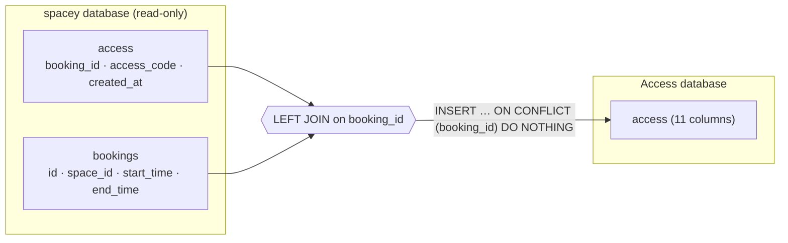

# Production data migration: copy access rows from `spacey`

A **one-time copy** of existing access codes from `spacey`'s production database into Access's
database, during the cutover ([migrate-from-spacey.md](migrate-from-spacey.md), step 3).
Script: [`scripts/migrate_from_spacey.py`](../scripts/migrate_from_spacey.py).

## What it copies



| Target column | Comes from |
|---|---|
| `booking_id`, `access_code`, `created_at` | `spacey` `access`, as is |
| `space_id`, `booked_start_time`, `booked_end_time` | `spacey` `bookings` (read **once**, here only) |
| `expires_at` | `booked_end_time` |
| `status` | `expired` if the booking has ended, otherwise `available`. Nobody has checked in yet: check-in is new |
| `checked_in_at`, `checked_out_at`, `removed_at` | empty: these events never happened in `spacey` |

Cancelled bookings aren't there to copy: in `spacey` their access rows were deleted with the booking
(`ON DELETE CASCADE`). So there's nothing to mark `removed`.

## Safety

- **Dry run by default:** it prints what it would do and writes nothing. `--apply` writes.
- **The source is read-only:** the script reads `spacey` in a read-only transaction.
- **Safe to run again:** existing rows in Access are skipped, never overwritten.
- **One transaction on the target:** all rows or none.
- **Known facts only:** no invented codes. A row without booking times keeps them empty.
- **It refuses** if both URLs are the same, or if the target has no `access` table yet.

## Runbook (cutover day)

| # | Step | Who |
|---|---|---|
| 1 | Snapshot both databases | SRE |
| 2 | Run `migrations/001_create_access_table.sql` on Access's database | Access |
| 3 | Dry run: `SOURCE_DATABASE_URL=<spacey, read-only user> TARGET_DATABASE_URL=<access> python scripts/migrate_from_spacey.py`. Check the counts | Access |
| 4 | `… --apply` | Access |
| 5 | Switch `spacey`'s `/unlock` to forward to Access (Purchase deploy) | Purchase |
| 6 | Run the script **again** with `--apply`, to pick up codes handed out between steps 4 and 5 | Access |
| 7 | Verify (below) | Access + SRE |

Steps 5–6 close the gap: a code handed out by `spacey` just before the switch is copied on the
second run, and existing codes are untouched.

## Verify

```sql
-- spacey (source)
SELECT count(*), count(DISTINCT access_code) FROM access;
-- Access (target): the same numbers, or more if Access granted new codes since
SELECT count(*), count(DISTINCT access_code) FROM access;
SELECT status, count(*) FROM access GROUP BY 1;   -- only available / expired right after the copy
```

Then the journey: an **existing** booking's `/unlock` returns the **same** code as before the cutover.

## Tested (locally, 2026-10-08)

Against a stand-in for `spacey` `main`'s schema, with 3 rows (a future booking, a past booking, and a
booking without times):

| Run | Result |
|---|---|
| dry run | "inserted 3", nothing written |
| `--apply` | 3 rows: `available`, `expired`, and `available` with empty times |
| `--apply` again | inserted 0, already there 3 |
| same URL for both | refused, exit 1 |

**Not tested against production data.** Run the dry run on a copy of production first.
